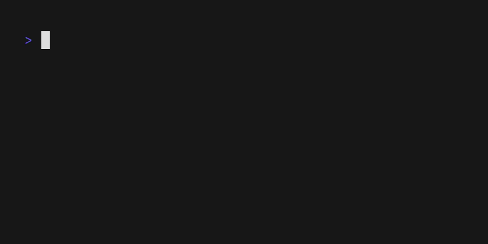

<h1 align="center">ddsk CLI</h1>

<p align="center">
<a href="https://github.com/koki-develop/ddsk/releases/latest"></a>
<a href="https://github.com/koki-develop/ddsk/releases/latest"></a>
<a href="https://github.com/koki-develop/ddsk/actions/workflows/ci.yml"></a>
<a href="https://codeclimate.com/github/koki-develop/ddsk/maintainability"></a>
<a href="https://goreportcard.com/report/github.com/koki-develop/ddsk"></a>
<a href="./LICENSE"></a>
</p>

<p align="center">
Love Injection
</p>

<p align="center">

</p>

> **Note**
> Inspired by: [@Sheeeeepla](https://twitter.com/Sheeeeepla/status/1554028833942441984)

## Contents

- [Installation](#installation)
- [Usage](#usage)
- [LICENSE](#license)

## Installation

### Homebrew Tap

```console
$ brew install koki-develop/tap/ddsk
```

### `go install`

```console
$ go install github.com/koki-develop/ddsk@latest
```

### Releases

Download the binary from the [releases page](https://github.com/koki-develop/ddsk/releases/latest).

## Usage

```console
$ ddsk --help
Love Injection

Usage:
  ddsk [flags]

Flags:
  -a, --animate   animate output
  -c, --color     colorize output
  -h, --help      help for ddsk
  -v, --version   version for ddsk
```

## LICENSE

[MIT](./LICENSE)
